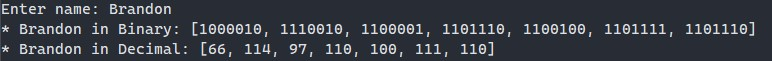

# Ascii Converter

---

## Description
This project is a library for converting between different Ascii representations in the Rust language.
This is made for Rust programs that need to convert an ascii value.
This library has methods for converting any of the supported representations to another.

Currently supported representations
- Binary
- Decimal
- Characters
- Hexadecimals

Full Documentation for this library can be found [here](https://docs.rs/ascii_converter)

---

## Installation

Add this to your projects Cargo.toml:

```toml
[dependencies]
ascii_converter = "0.3.0"
```

---

## Usage
This library consists of several functions that follow the same simplistic convention, input the data and the new representation is returned.

below is a program that converts text to binary and decimal. this code can be found in the examples/conversion.rs 

```rust
use ascii_converter::*;
use std::io::*;

fn main() {

    let mut name = String::new();
    
    print!("Enter name: ");

    stdout().flush().expect("unable to flush buffer");

    //reads user input and assigns it to the name variable
    stdin().read_line(&mut name).unwrap();

    let name = name.trim();

    //outputs the binary representation
    println!("* {} in Binary: {:?}", name, string_to_binary(&name).unwrap());
    
    //outputs the decimal representation
    println!("* {} in Decimal: {:?}", name, string_to_decimals(&name).unwrap());

}
```
Running the code above will give you the output below 



---

## License

[MIT](LICENSE.md)

